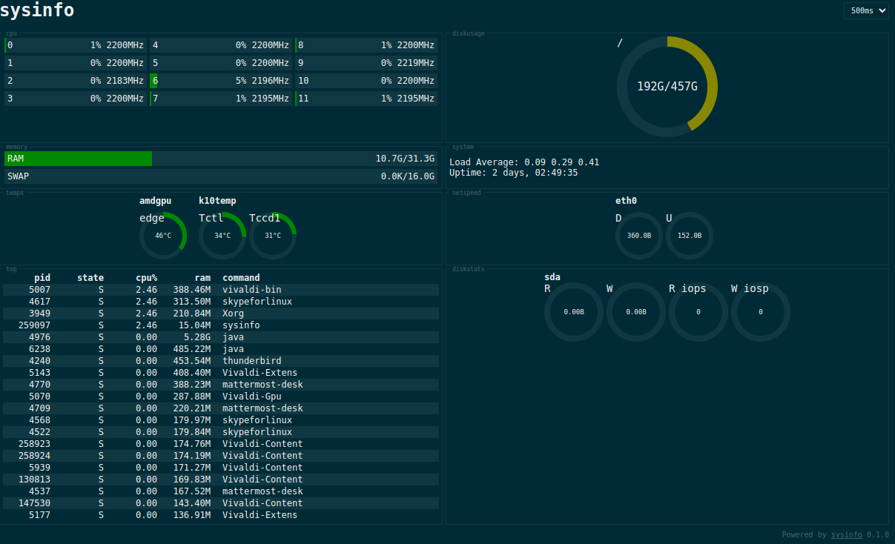

# sysinfo
Simple sysinfo website for Linux

```
Usage: sysinfo [options]
Options:
	-h, --help			print this help
	-v, --version			print version
	-n, --name [NAME]		name of application to be displayed
	-p, --port [PORT]		sets port for listening
	-a, --app-url [APP_URL]		application url (if behind proxy)
```



## Roadmap
- [X] CPU usage and frequency widget
- [X] RAM and SWAP widget
- [X] System temperature widget
- [X] Diskusage widget
- [X] Load Average and Uptime widget
- [ ] Custom interval with possible pause option
- [ ] Custom widget layout with possible configuration of widgets
- [ ] Disk IOPS?
- [ ] Network usage
- [ ] Process watcher